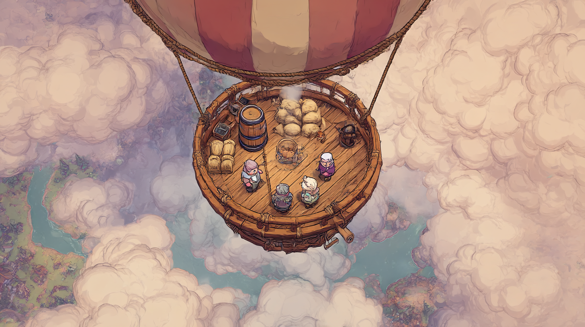
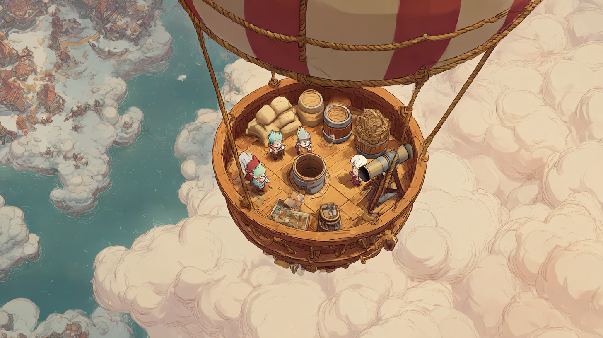
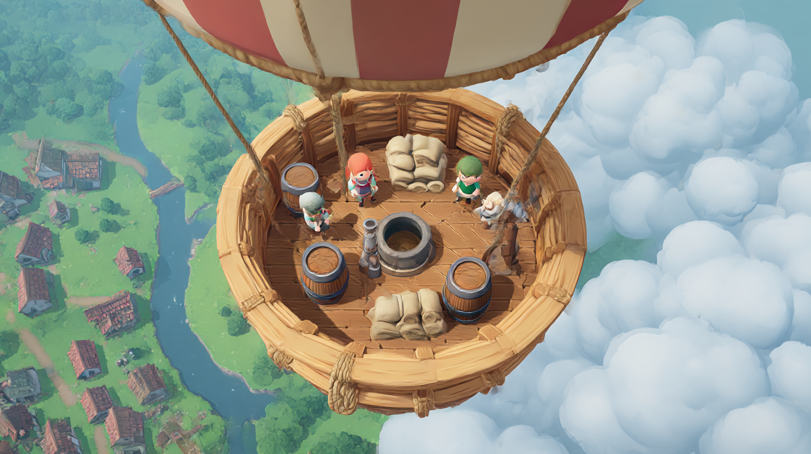
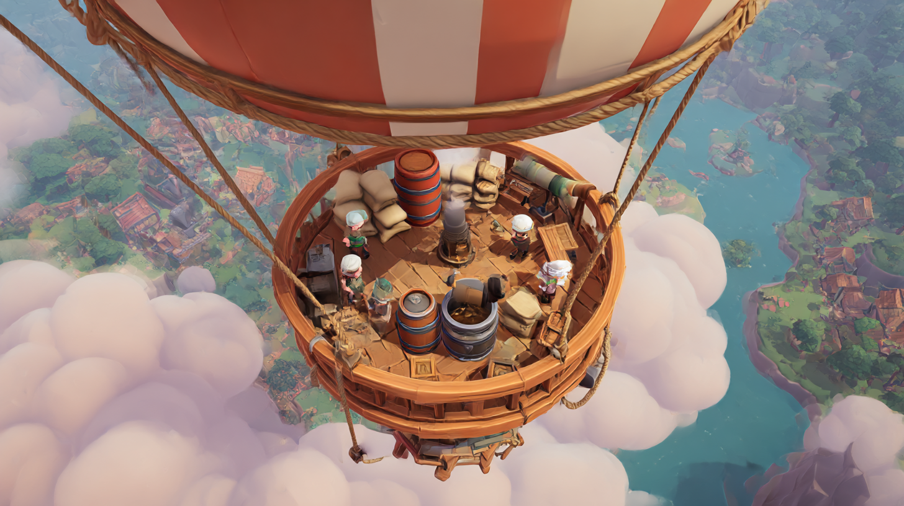
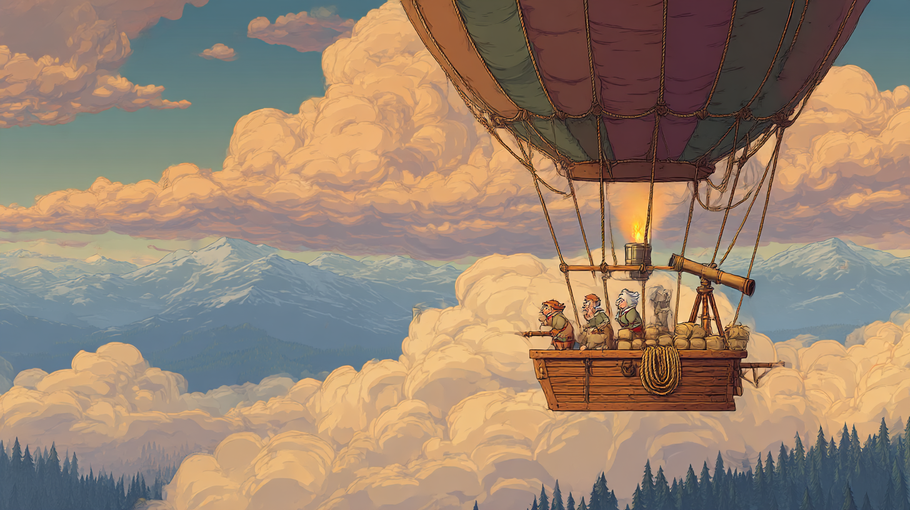
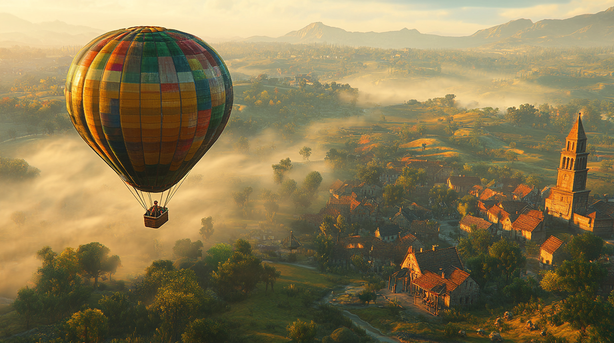

# Mostly Hot Air — Game Design Document

> **Hinweis:** Dies ist ein eigenständiges Projekt, nicht Teil von Wurzelwerk.
> Sobald der Prototyp-Scope steht, sollte es in ein eigenes Repo umziehen.

## $meta
- **Version:** 0.6.0
- **Status:** Frühe Konzeption, visuelle Richtung festgelegt, Titel festgelegt, MVP-Hypothesen formuliert, H1-Detail-Design verabschiedet, H5 (Motor-Steuerung) als Prototyp-Abzweig in `mvp_zeta`
- **Erstellt:** 2026-04-16
- **Engine:** Godot 4
- **Modus:** Lokaler Couch-Coop, 2–4 Spieler (Online optional später)
- **Referenz-Spiele:** Overcooked (Steuerung, Enge), Unrailed (Rollen-Flexibilität, Upgrade-Schleife), Lovers in a Dangerous Spacetime (gemeinsames Fahrzeug), RV there yet

---

## 1. Vision

### 1.1 Pitch (Marketing-Text)

> **Mostly Hot Air** ist ein chaotisches lokales Couch-Coop-Ballonspiel, in dem sich 2–4 Freund:innen einen einzigen Heißluftballon teilen und ihn durch windige, wolkenverhangene Himmel von A nach B bringen müssen. Brenner befeuern, Sandsäcke abwerfen, durchs Fernrohr spähen, am Seil abseilen — alles Schulter an Schulter in einem Korb, der bei jedem Fehltritt kippt. Beherrscht die Winde, beherrscht euch gegenseitig — oder ihr erreicht den nächsten Horizont nie!
>
> **HALTET DEN BALLON LÄNGER OBEN ALS JE ZUVOR**
>
> Der Wind weht in jeder Höhe in eine andere Richtung — Steigen und Sinken *ist* eure Lenkung. Brennstoff für Auftrieb, Ballast für den schnellen Aufstieg, Anker für den Notstopp. Doch die Welt darunter liegt unter dichten Wolken verborgen: Nur das Fernrohr reißt kurz ein Loch hinein, und sobald jemand loslässt, schließt es sich wieder — also ruft schnell! Jeder erfolgreiche Flug bringt Propeller, mit denen ihr euren Ballon ausbaut. Größere Hüllen erschließen weitere Strecken, neue Stationen füllen den Korb, das Chaos wächst Run für Run. Es gibt keine festen Rollen — Spezialisierung entsteht aus einem Korb, der zu klein ist, damit jede:r alles gleichzeitig tun kann.

### 1.2 Designvision

Ein Couch-Coop-Chaos-Spiel. 2–4 Spieler teilen sich einen Heißluftballon und müssen ihn durch wechselhafte Level von A nach B bringen. Der Ballon driftet mit dem Wind; **Höhe ist die primäre Lenkung**. Im engen Korb werden Stationen bedient: Brenner, Ventil, Ballast, Fernrohr, Seil, Anker, Reparatur. Jeder Spieler kann jede Aufgabe übernehmen — **Spezialisierung entsteht durch räumliche Knappheit**, nicht durch fixe Rollen.

**Zielgefühl:** Hektische Koordination im engen Raum, kurze ruhige Momente zwischen den Etappen, kleine strategische Entscheidungen beim Upgrade.

**Ausgeschlossen aus MVP:** Konvoi-Modus, Online-Multiplayer, Kampagne/Story, Fernrohr-Upgrades über "Marker" hinaus.

### 1.3 MVP-Hypothesen

Der MVP ist kein "reduziertes Spiel", sondern ein gezieltes Experiment. Diese Hypothesen ordnen, welche Annahmen das Projekt stützen und in welcher Reihenfolge sie validiert werden müssen.

**Kill-Hypothesen** — falsch → Konzept radikal überdenken oder Projekt kippen:

#### H1 — Navigations-Fun
*Ist indirekte Steuerung über Höhenwechsel (Wind pro Höhenband) als Kern-Spielmechanik spaßig und nicht-trivial?*
- **Validiert durch:** M1 (Etappen 0–4 in §6): Wind + Höhe + Brenner + fester Brennstoff-Vorrat + Ziel. Solo spielbar.
- **Risiko:** Mittel. Ballooning-Games wie *Passing By* zeigen, dass das Prinzip trägt — aber ob es als Fundament für Coop-Chaos reicht, ist offen.
- **Abbruchkriterium:** Spielrunden fühlen sich nach 2–3 Versuchen zäh oder vorhersehbar an; Höhenwechsel wird zur stumpfen Pflichtübung statt zur Entscheidung.
- **Detail-Spezifikation:** [`H1_DESIGN.md`](H1_DESIGN.md) — konkrete Parameter, Mechaniken, Kamera, Level-Architektur für die M1-Implementierung.

#### H2 — Coop-Kommunikations-Druck
*Erzeugen Wolken als Fog-of-War + Fernrohr als geteiltes Sichtwerkzeug echten verbalen Austausch und gegenseitige Abhängigkeit — statt zu einer Einzelansage oder Solo-Operation zu degenerieren?*
- **Validiert durch:** M2 (Etappen 5–8 in §6): 2–4 Spieler + Wolken + Fernrohr. Vertical Slice.
- **Risiko:** **Hoch.** Das ist die eigentliche Produkt-Wette — keine existierende Spielvorlage beweist, dass *dieses* Coop-Konzept die versprochene Dynamik erzeugt.
- **Abbruchkriterium:** Ein Spieler spottet, ruft Koordinaten — die anderen führen aus. Kein Drama, kein Aushandeln, keine geteilte Aufmerksamkeit.

**Optimierungs-Hypothesen** — post-MVP; beeinflussen Spieltiefe, nicht Existenzberechtigung:

#### H3 — Stations-Enge als Chaos-Quelle
*Erzeugt räumliche Knappheit im Korb das gewünschte Overcooked-artige Chaos ohne fixe Rollen?*
Validierbar ab Etappe 11+ mit voll ausgebautem Korb und mehreren Upgrades.

#### H4 — Roguelite-Pull
*Macht die Propeller-Upgrade-Schleife Lust auf Folgeruns?*
Validierbar ab Etappe 15 mit kompletter Run-Struktur (≥3 Level, Upgrade-Menü).

**Alternativ-Hypothese zu H1** — Abzweig, der H1 ersetzen würde, falls er sich im Handspiel als besser erweist:

#### H5 — Motor-Steuerung mit Wind als Störung
*Trägt eine direkte Steuerung (schwenkbarer Außenbordmotor, ca. 80 % Kontrolle) plus Windbänder als 20 % Störung und Hilfe besser als die rein indirekte Höhensteuerung aus H1?*
- **Modell:** Ein **Pilotenstand** in der Korbmitte bündelt Brenner, Ventil, Pinne und Gashebel (drei Stufen). Der Motor sitzt auf einer Schiene um den Korb und schiebt in Pinnenrichtung; die Pinne bleibt stehen, wenn niemand am Stand ist. Der Wind bleibt: unteres Band böig mit Wirbeln im Lee der Berge und Thermik über Dörfern, mittleres Band halb so böig, oberes Band schnell und ruhig. Das Verhältnis Motor : Wind ergibt sich aus der Bandstärke (unten ≈ 80 : 20, oben ≈ 60 : 40). Motor und Brenner teilen sich den Tank, Halbgas ist fast umsonst, Vollgas teuer — mit dem Wind fahren spart.
- **Realitätsbezug:** In der atmosphärischen Grenzschicht nimmt der Wind mit der Höhe zu und wird gleichmäßiger, unten erzeugen Bodenreibung und Thermik Turbulenz; die Richtung dreht mit der Höhe (Ekman-Spirale), echte Gegenrichtungen sind Sonderfälle (Albuquerque Box).
- **Validiert durch:** `mvp_zeta` (Pilotenstand-Umbau, 2026-09-23). Solo spielbar.
- **Risiko:** Mittel. Mit 80 % Kontrolle wird das Spiel leicht, sobald der Spieler am Stand bleiben kann — die Spannung muss aus Werkstatt-Kette, Sprit und Böen kommen. Der Bot bleibt im unteren Band und umfährt Berge; ob die oberen Bänder je attraktiv sind, ist offen.
- **Abbruchkriterium:** Windbänder werden ignoriert, Höhe wird nur noch für Berge geändert, Fahrten fühlen sich wie „Punkt anfahren" an. Dann ist H5 nur ein Twin-Stick-Lieferspiel und H1 bleibt.
- **Coop-Konsequenz (falls H5 trägt):** Der Pilotenstand ist *eine* Station für *eine* Person; alle anderen können nur indirekt eingreifen (Fernrohr, Ballast, Werkstatt). Das verschärft H2, entscheidet aber nichts vor dem Handspiel.

---

**Konsequenz für §6 Entwicklungsetappen:**
- **M1 = Tech-MVP** (Etappen 0–4) — validiert H1
- **M2 = Produkt-MVP / Vertical Slice** (Etappen 5–8) — validiert H2. *Erst hier entscheidbar, ob das Spiel als Coop-Produkt trägt.*
- Alles danach setzt voraus, dass beide Kill-Hypothesen bestätigt sind.

---

## 2. Kernmechaniken (beschlossen)

### 2.1 Ballon-Physik
- Ein einzelner Ballon, alle Spieler im gemeinsamen Korb.
- Höhe ist die Hauptsteuerung. Wind pro Höhen-Band unterschiedlich → Höhenwechsel = Richtungswechsel.
- Brenner erzeugt Auftrieb; ohne Brenner sinkt der Ballon langsam.
- Balance / Schräglage: Gewichtsverteilung (Spielerposition, Ballast, Fracht) beeinflusst Kippen.

### 2.2 Wolken & Sicht
- Die Welt ist durch Wolkenfelder teilweise verdeckt.
- Wolken verbergen Bonus-Propeller, Hindernisse, Landmarken.
- Wolkendichte ist zentraler Level-Design-Hebel für Schwierigkeit.

### 2.3 Fernrohr
- Eigene Station am Korbrand. Spieler muss dort stehen und Taste halten.
- Während gehalten: Sichtfenster, frei mit zweitem Input (Stick/Maus) im Radius um den Ballon bewegbar.
- Reißt lokal ein Loch in die Wolkendecke. Alle Spieler sehen durch dasselbe Loch.
- **Loch schließt sofort bei Taste loslassen** → Information muss in Echtzeit kommuniziert werden.
- **Upgrade "Marker":** ein Marker, platzierbar durchs Loch, bleibt sichtbar auch nach Schließen. Ein neuer Marker überschreibt den alten.

### 2.4 Propeller-Ökonomie (Roguelite-Schleife)
- **Garantiert:** 1 Propeller pro erfolgreich abgeschlossenem Flug. Bedingung: mind. 1 Spieler im Korb bei Ankunft.
- **Bonus:** max. 1 zusätzlicher Propeller pro Level. Sichtbar, aber dezent platziert — meist unter Wolken.
- **Scheitern:** Ziel nicht erreicht → kein Propeller, Level komplett neu.

### 2.5 Bonus-Propeller einsammeln
Zwei Methoden, als Tradeoff:
- **Seil-Abseilen (Baseline):** Spieler seilt sich an einer Seil-Station ab, läuft zum Propeller, seilt zurück. Während dessen: Korb ist leichter auf einer Seite (Balance), eine Station ist unbesetzt.
- **Greifarm (Upgrade):** Schneller, sauberer, niemand verlässt den Korb. Kostet Upgrade-Slot.

### 2.6 Anker
- Wirft Anker → Ballon stoppt horizontal.
- Bei Wind: Ballon kippt schräg → Balance-Probleme (Items rutschen, Spieler taumeln).
- Primär-Einsatz: kontrolliertes Absammeln, Notstopp vor Hindernis.

### 2.7 Spieler-Respawn
- Spieler außerhalb Sichtbereich verloren → Respawn im Korb nach 10–15 Sek.
- Kein permanenter Spielerverlust (Couch-Coop-Fairness, wie Unrailed).
- Seil ist unzerreißbar und nicht abwerfbar (keine "Griefing"-Fläche).

### 2.8 Upgrades zwischen Runden
- Upgrade-Auswahl zwischen Levels, bezahlt mit Propellern.
- **Variable Preise** (1–N Propeller).
- **Hülle / Ballon selbst** ist das teure "Big Ticket"-Upgrade. Gating für späte Strecken — ohne Hüllen-Upgrade sind entferntere Ziele unerreichbar (analog Lokomotive in Unrailed).
- Upgrades fügen bevorzugt **neue Aufgaben oder Stationen** hinzu, nicht nur Stat-Boni — sonst verflacht die Entscheidung.

**Kandidaten-Upgrades (Diskussion offen, aber Basis):**
| Upgrade | Preis (Richtwert) | Effekt |
|---|---|---|
| Marker fürs Fernrohr | günstig | Ein Pin durchs Loch platzierbar, bleibt sichtbar |
| Brennstoff-Tank | günstig | Höhere Vorratsmenge |
| Brenner-Effizienz | mittel | Weniger Verbrauch pro Auftrieb |
| Ballast-Kapazität | mittel | Mehr Sandsäcke an Bord |
| Greifarm | mittel–teuer | Alternative zum Seil-Abseilen |
| Funkenfänger | mittel | Brenner beschädigt die eigene Hülle nicht mehr |
| Hülle Stufe 2 / 3 | **sehr teuer** | Ermöglicht weitere Strecken / robustere Hülle |

---

## 3. Korb-Stationen (MVP-Baseline)

Das Korb-Layout bestimmt, wie viel Chaos entsteht (Abstände, Engpässe). Level-Design-Hebel.

- **Brenner** — Taste halten = Auftrieb, verbraucht Brennstoff
- **Ventil** — Taste halten = sinken (schneller als passives Abkühlen)
- **Ballast-Stapel** — Sandsack abwerfen = Sofort-Aufstieg
- **Brennstoff-Lager** — Tank, aus dem Brenner gespeist wird; nachfüllbar von hier
- **Fernrohr** — Sicht durch Wolken (s. 2.3)
- **Seil-Station** — Abseilen zum Einsammeln
- **Anker-Station** — Ballon anhalten (s. 2.6)
- **Reparatur-Werkbank** — sobald Gefahren eingeführt sind

Upgrades fügen neue Stationen hinzu (z.B. Greifarm, Hilfspropeller) → Korb wird dichter → Spielgefühl wandelt sich.

---

## 4. Moodboard & visuelle Richtung

Fünf Midjourney-Generierungen dienen als Referenz. Die ersten vier zeigen **Gameplay-Perspektiven** (schräg-Draufsicht, runder Korb), das fünfte ist reine **Key-Art / Cover-Stimmung**.

### 4.1 Gameplay-Referenzen

#### Bild 1 — Painterly, aufgeräumt

- **Perspektive:** Schräg-Draufsicht ~45°, runder Korb.
- **Stil:** 2D-painterly, warme Farben, Don't-Starve-meets-Overcooked.
- **Repräsentiert:** Die *aufgeräumte* Variante — wenige klare Stationen (Fässer, Sandsäcke), vier Figuren gut sichtbar. Ein früher Korb, vor vielen Upgrades.
- **Möglichkeiten:** Starker künstlerischer Charakter, unverwechselbar, warm.
- **Fragen / Risiken:**
  - Handgezeichnete Assets → hoher Illustrations-Aufwand für ein kleines Team.
  - Charaktere sind klein — bei 4 Spielern gleichzeitig Lesbarkeit kritisch?

#### Bild 2 — Painterly, stationsreich

- **Perspektive:** Schräg-Draufsicht, leicht steilerer Winkel.
- **Stil:** 2D-painterly, dicht möblierter Korb (Teleskop, Steuerruder, Kiste, Fässer, Sandsäcke).
- **Repräsentiert:** Das "voll ausgebaute" Korb-Gefühl — viele Stationen, richtig was zu tun. So könnte ein Korb im späten Run aussehen.
- **Möglichkeiten:** Zeigt, wie Upgrades den Korb *physisch füllen* können. Station-Dichte als visuelles Progressions-Signal.
- **Fragen / Risiken:**
  - Zu viele Details = überladen, auf kleinem Bildschirm schwer lesbar?
  - Runde Korbform mit offener Mitte: gibt das echte Engpässe?

#### Bild 3 — 3D-Render, Overcooked-Style

- **Perspektive:** Schräg-Draufsicht, runder Korb mit **zentralem Brenner als Hindernis**.
- **Stil:** 3D mit toon-ähnlichem Shading, saubere Silhouetten, bright & friendly.
- **Repräsentiert:** Die **produktionsrealistische** Zielgrafik für Godot 4.
- **Möglichkeiten:** Direkt umsetzbar mit toon-Shader und überschaubarem Asset-Budget. Wiedererkennbare Overcooked-DNA.
- **Fragen / Risiken:**
  - Etwas generischer als painterly — wie setzen wir uns grafisch ab?
  - Mittig platzierter Brenner ist ein **gutes Layout-Prinzip** — zwingt Spieler, sich *um* das Zentrum zu bewegen statt durch.

#### Bild 4 — 3D-Render, dramatische Wolkenschichtung

- **Perspektive:** Schräg-Draufsicht, steilerer Winkel, klarer Höhen-Eindruck.
- **Stil:** 3D, **kräftige Tiefenwirkung** durch Wolkenschichten über und unter dem Korb, Landschaft weit unten.
- **Repräsentiert:** Wie Höhe und Wolkendecke (§2.2) visuell vermittelt werden — der Moment, wo das "Fog-of-War"-Wolken-Konzept sichtbar wird.
- **Möglichkeiten:** Diese Tiefenwirkung sollte der Prototyp anstreben — sie verkauft die Kernmechanik "Wolken verbergen, was drunter ist".
- **Fragen / Risiken:**
  - Volumetrische Wolken sind performance-hungrig. Wahrscheinlich mit geschichteten 2D-Sprites / Partikeln approximieren.

### 4.2 Key-Art / Cover

#### Bild 5 — Seitenansicht, cinematic

- **Perspektive:** Reine Seitenansicht — **nicht** für Gameplay geeignet.
- **Stil:** 2D-painterly, epische Reise-Stimmung, Bergketten im Hintergrund.
- **Repräsentiert:** Die *emotionale* Ebene des Spiels — Reise, Weite, Zusammenhalt, Abenteuer.
- **Nutzung:** Key-Art, Titelbild, Kapitel-Übergänge, Marketing. **Kein Gameplay-View.**

### 4.3 Abgeleitete Entscheidungen

- ✅ **Gameplay-Perspektive:** Schräg-Draufsicht ~45°, runder Korb. (Vorher offene Frage — jetzt geschlossen.)
- ✅ **Korb-Grundform:** Rund, mit zentralem Element (vermutlich Brenner), das Wege um die Mitte herum zwingt.
- ✅ **Stil-Richtung:** 3D-Low-Poly mit Toon-Shader und warmer Beleuchtung — Hybrid zwischen Bild 3/4 (produktionsrealistisch) und Bild 1/2 (Atmosphäre). Realistisch für ein kleines Team in Godot 4.
- ✅ **Wolken als aktives visuelles Element:** geschichtet, mit sichtbarer Tiefe (Bild 4 als Referenz-Niveau).
- ✅ **Station-Dichte als Progressions-Signal:** leerer Korb früh (Bild 1), voller Korb spät (Bild 2).

### 4.4 Neue offene Fragen aus dem Moodboard

- **Korb-Zentrum:** Brenner mittig (Bild 3) vs. andere zentrale Elemente? Was bringt die beste Engpass-Dynamik?
- **Charakter-Proportion:** Chibi/stilisiert (Bild 3/4) oder bodenständiger (Bild 1/2)?
- **Wolken-Technik in Godot 4:** Layered 2D-Sprites mit Parallax, volumetrische Shader, oder Partikelsysteme? Performance-Tradeoffs?
- **Farb-Palette:** Warm/herbstlich (Bild 1/2) oder bunter/heller (Bild 3)?

### 4.5 Kamera-Baseline (aus H1-Design)

Während der H1-Diskussion (2026-04-17) wurde die Gameplay-Kamera konkretisiert und visuell validiert. Ergebnis-Bilder werden als neue Moodboard-Referenzen geführt.

#### Bild 6 — Kamera-Baseline (Cruise, Golden Hour)

- **Perspektive:** 45°-Schräg-Draufsicht, Ballon bei ~30 % von links, ~70 % des Bildes zeigt Look-ahead in Ziel-Richtung.
- **Repräsentiert:** Die konkrete Kamera-Einstellung für Gameplay in M1. Ballon hat Charakter und Präsenz, Umgebung zeigt genug Kontext für Vorausplanung.
- **Nutzung:** **Baseline-Referenz für die M1-Kamera-Implementierung.** Details in [`H1_DESIGN.md`](H1_DESIGN.md) §9.
- **Hinweis:** Wind-Bänder sind in dem Bild nicht erkennbar dargestellt — Midjourney rendert stratifizierte Atmosphäre schlecht. Bänder werden im Godot-Prototyp direkt entwickelt (siehe H1_DESIGN.md §8 und §13.5).

#### Stimmungs-Varianten (Bilder 7–10)

Dieselbe Kamera, unterschiedliche Tageszeiten/Atmosphären — dienen als **Stimmungs-Spektrum** für spätere Level-Design-Variation, nicht als primäre Referenz:

- `references/moodboard_07_camera_cruise_wide.png` — weiter Vista mit Bergen
- `references/moodboard_08_camera_cruise_misty.png` — morgens, dichter Bodennebel
- `references/moodboard_09_camera_cruise_evening.png` — dramatisches Abendlicht
- `references/moodboard_10_camera_cruise_dawn.png` — Dämmerung mit Kirchturm-Silhouette

---

## 5. Offene Designfragen (vor oder während Prototyp zu entscheiden)

1. **Wind-Visualisierung:** Wie sehen Spieler Windrichtungen je Höhe? (Wolken driften, Flaggen, Rauchfahnen, UI-Indikator?)
2. **Brennstoff-Nachschub:** Nur zwischen Leveln auffüllbar, oder im Flug über Depots/Greifarm sammelbar?
3. **Gefahren-Katalog:** Welche Hindernisse und Events? (Berge, Gewitter, Vögel, Feuerfunken aus dem Brenner, …)
4. **Level-Progression:** Endlos mit prozeduraler Variation, oder strukturierte Kampagne mit festen Leveln, oder beides?
5. **Multiplayer-Technik:** Shared-Screen oder Split-Screen? (Shared ist einfacher, passt zu Overcooked-Ästhetik.)
6. **Input-Geräte:** Controller-Pflicht, oder auch Tastatur-Splits?
7. **Anker-Detail:** Bei welcher Windstärke kippt der Ballon? Was passiert bei maximaler Schräglage?
8. *(Aus §4.4)* Korb-Zentrum, Charakter-Proportionen, Wolken-Technik, Farbpalette.
9. **Hauptsteuerung: Höhe (H1) oder Motor (H5)?** Entscheidung nach Handspiel von `mvp_zeta` mit Pilotenstand. Bei H5: Sind Spritpreise und Böenstärke die richtigen Stellschrauben, damit die oberen Bänder gebraucht werden? Bleibt der Brenner als Station interessant, wenn er nicht mehr lenkt?

---

## 6. Entwicklungsetappen (Godot 4 Prototyp)

**Prinzip:** Jede Etappe hinterlässt etwas **Lauffähiges und Testbares**. Reihenfolge ist Vorschlag — Design-Iterationen können Etappen umwerfen.

Etappen sind **Epics**; Bulletpoints innerhalb sind **Tickets** (Zielgröße <1 Tag).

**Meilensteine** (siehe §1.3 MVP-Hypothesen):
- **M1 — Tech-MVP** (Etappen 0–4): validiert **H1 Navigations-Fun**. Solo spielbar.
- **M2 — Produkt-MVP / Vertical Slice** (Etappen 5–8): validiert **H2 Coop-Kommunikations-Druck**.
- **Post-MVP** (ab Etappe 9): Tiefe, Retention, Polish — nur sinnvoll, wenn H1 und H2 bestätigt sind.

---

> **▶ M1 — Tech-MVP beginnt** · Ziel: H1 validieren (ist die Kern-Physik spaßig?)
> Detail-Spezifikation: [`H1_DESIGN.md`](H1_DESIGN.md)

### Etappe 0 — Projekt-Setup
- Godot-4-Projekt anlegen, Git initialisieren
- Ordnerstruktur (scenes, scripts, assets, …)
- Input-Actions für Bewegung + Interact definieren
- Test-Szene mit bewegbarem Character
- **Testbar:** Character läuft im leeren Raum.

### Etappe 1 — Korb & Spielerbewegung
- Statischer runder Korb als Bühne (Moodboard Bild 3 als Layout-Vorlage), Kollisionsgrenzen
- Character läuft im Korb, interagiert mit Dummy-Station
- Kamera: Schräg-Draufsicht ~45°, fixed offset zum Korb
- **Testbar:** Ein Spieler läuft im Korb herum, kann eine Station "benutzen".

### Etappe 2 — Passiver Ballon-Flug
- Welt scrollt, Ballon bleibt zentriert
- Fester Wind treibt Ballon konstant in eine Richtung
- Start- und Ziellinie sichtbar
- **Testbar:** Ballon fliegt passiv ins Ziel.

### Etappe 3 — Brenner & Höhensteuerung
- Brenner-Station: Taste halten = Höhe steigt
- Ohne Brenner: Höhe fällt passiv
- Absturzgrenze unten (Boden berühren = Fail)
- Einfache Höhen-Anzeige (UI-Balken)
- **Testbar:** Aktives Höhenhalten nötig, um nicht abzustürzen.

### Etappe 4 — Brennstoff-Loop
- Brennstoff-Vorrat (Tank)
- Brenner verbraucht Brennstoff
- Nachfüll-Station (Lager mit Vorrat pro Level)
- **Testbar:** Management von Brennstoff notwendig, sonst Absturz.

---

> **■ M1 abgeschlossen** — H1 an echten Spielern validieren *bevor* M2 startet.
> **▶ M2 — Produkt-MVP / Vertical Slice beginnt** · Ziel: H2 validieren (erzeugt das Coop-Setup echten Kommunikationsdruck?)

### Etappe 5 — Lokaler Multiplayer
- 2–4 Spieler per Controller (Godot 4 `Input` / Device-IDs)
- Alle Spieler im selben Korb, shared screen
- **Testbar:** Zwei Menschen spielen zusammen.

### Etappe 6 — Höhenabhängiger Wind
- Mehrere Höhen-Bänder mit unterschiedlichen Windrichtungen
- Ballon driftet horizontal je nach Höhe
- Ziel so platziert, dass Höhenwechsel nötig ist
- Wind-Visualisierung implementieren (Entscheidung aus §5.1 hier festlegen)
- **Testbar:** Erste echte Navigation durch Höhenwechsel.

### Etappe 7 — Wolkendecke
- Wolken-Layer verdeckt Bodensicht teilweise
- Wolken bewegen sich mit Wind
- Referenz-Niveau: Moodboard Bild 4 (geschichtete Wolken mit Tiefenwirkung)
- **Testbar:** Fliegen mit eingeschränkter Sicht.

### Etappe 8 — Fernrohr
- Fernrohr-Station, Halten-Taste
- Zweiter Input bewegt Sicht-Radius um Ballon
- Loch in Wolken lokal aufgerissen, schließt bei Loslassen
- **Testbar:** Coop-Spotting-Dynamik ("da rechts unten!").

---

> **■ M2 abgeschlossen** — H2 an echten Coop-Runden validieren *bevor* Post-MVP-Umfang wächst.
> **▶ Post-MVP beginnt** · Fokus verschiebt sich von Existenz-Hypothesen zu Tiefe (H3 Stations-Enge) und Retention (H4 Roguelite-Pull).

### Etappe 9 — Bonus-Propeller & Seil-Abseilen
- Bonus-Propeller als Objekt im Level, oft unter Wolken
- Seil-Station: Spieler seilt sich ab, läuft am Boden, sammelt, klettert zurück
- Respawn-Timer bei Verlust
- **Testbar:** Coop-Entscheidung "Umweg ja/nein", Abseil-Drama.

### Etappe 10 — Run-Abschluss & Upgrade-Menü
- Ziel erreicht → Propeller gutgeschrieben
- Upgrade-Screen mit Auswahl (3–5 Upgrades, Preise)
- Upgrade kaufen → nächstes Level starten
- **Testbar:** Erste komplette Roguelite-Schleife.

### Etappe 11 — Erste aktive Upgrades
- Marker fürs Fernrohr
- Brennstoff-Tank-Kapazität
- Brenner-Effizienz
- **Testbar:** Upgrades machen spürbaren Unterschied.

### Etappe 12 — Gefahren
- Berge (Kollision → Hüllen-Schaden)
- Zweiter Gefahr-Typ (Vögel oder Gewitter)
- Reparatur-Werkbank aktiv (Patches auf Hüllenschäden)
- **Testbar:** Echte Bedrohung, Reparieren als laufende Aufgabe.

### Etappe 13 — Balance & Schräglage
- Gewichtsverteilung beeinflusst Kipp-Winkel
- Anker-Mechanik: Stopp + Schräglage bei Wind
- Sichtbare Auswirkungen (Items rutschen, Kamera tilt)
- **Testbar:** "Wer geht jetzt nach rechts?"-Dynamik entsteht.

### Etappe 14 — Greifarm-Upgrade
- Alternative zum Seil-Abseilen
- Neue Station im Korb
- **Testbar:** Upgrade-Tradeoff greifbar ("mit Greifarm ist's easy, aber wir hätten auch X nehmen können").

### Etappe 15 — Mehrere Level / grober Run-Aufbau
- 3–5 handgebaute oder prozedurale Level
- Sequenz: Level → Upgrade → Level → Upgrade → …
- **Testbar:** Kompletter "Run" von 20–30 Minuten möglich.

### Ab Etappe 16 — Tuning & Polish
Weitere Upgrades, weitere Gefahren, Sound, Visual Polish, Balance-Tuning, Menü, Pause, Niederlage-Screen.

---

## 7. Vom Dokument zu Tickets

**Regel:** Jede Etappe ist ein Epic. Jeder Bulletpoint darin ist Kandidat für ein Ticket (<1 Tag Arbeit). Ist ein Bulletpoint größer, in kleinere Tickets aufspalten.

**Beispiel Etappe 3 → Tickets:**
- Brenner-Station: Node anlegen, Interact-Hook
- Auftriebs-Physik (während gehalten: vy += schub)
- Sink-Physik (passiv: vy -= schwerkraft)
- Kollision mit Bodengrenze = Fail-State
- Höhen-UI als simpler Balken oben links

---

## 8. Änderungshistorie
- **2026-09-23 · v0.6.0** — Neue Alternativ-Hypothese **H5 Motor-Steuerung** in §1.3: schwenkbarer Außenbordmotor als ca. 80 % der Steuerung, Windbänder als 20 % Störung/Hilfe, Turbulenz nimmt mit der Höhe ab (Grenzschicht-Modell, recherchiert). Umgesetzt im Prototyp `mvp_zeta` als **Pilotenstand** (Brenner, Ventil, Pinne, Gashebel zentral, Twin-Stick). Neue offene Frage §5.9 (Höhe vs. Motor als Hauptsteuerung). §2 bleibt unverändert, bis das Handspiel entschieden hat.
- **2026-04-17 · v0.5.0** — H1-Detail-Design verabschiedet und als separates Dokument `H1_DESIGN.md` angelegt. GDD bekommt Referenzen von §1.3 (H1-Hypothese) und §6 (M1-Banner) zum Detail-Dokument. §4 um Subsektion 4.5 „Kamera-Baseline" erweitert; `moodboard_06_camera_cruise_golden.png` als primäre Kamera-Referenz, Varianten 07–10 als Stimmungs-Spektrum. Hintergrund: mehrstündige Design-Diskussion hat Conveyor-Belt-Mentalmodell (Chip's-Challenge-Analogie), Wind-Viz-Hybrid (diegetische Schleier + Messing-HUD bottom-right), Level-Dimensionen (1500–3000m × 300–400m), Drift-Parameter (7–9 m/s + Turbulenz), Ballon-Physik (Binary-Brenner mit Lag/Afterglow, passives Sinken), Brennstoff-System (Ein-Pool, Glide-to-Ground), Win/Fail-Logik (Landing-Zone mit Retry solange Brennstoff reicht) und Kamera-Spec (Variante B, zielorientiert, vertikale Dämpfung) festgelegt.
- **2026-04-17 · v0.4.1** — §6 Entwicklungsetappen um Meilenstein-Marker erweitert: Meilenstein-Übersicht unter der §6-Einleitung; visuelle Banner-Einschübe vor Etappe 0 (M1 Start), vor Etappe 5 (M1→M2 Übergang) und vor Etappe 9 (M2→Post-MVP Übergang). Jeder Übergang erinnert an das Validierungs-Gate der jeweiligen Kill-Hypothese.
- **2026-04-17 · v0.4.0** — §1.3 MVP-Hypothesen hinzugefügt. Zwei Kill-Hypothesen (H1 Navigations-Fun, H2 Coop-Kommunikations-Druck) mit Abbruchkriterien; zwei Optimierungs-Hypothesen (H3 Stations-Enge, H4 Roguelite-Pull) als post-MVP. Einführung zweier Meilensteine M1 (Tech-MVP, Etappen 0–4) und M2 (Produkt-MVP / Vertical Slice, Etappen 5–8) als Validierungs-Gates.
- **2026-04-17 · v0.3.0** — Spielname festgelegt: **Mostly Hot Air** (vormals Arbeitstitel "Ballon-Koop"). Selbstironischer Ton passt zum Couch-Coop-Chaos; Varianten "Hot Air" (Kollision mit Steam-Titel "Hot Air Balloon Simulator") und "Fair Winds" (zu ruhig) verworfen. §5.8 (offene Namensfrage) geschlossen und entfernt.
- **2026-04-16 · v0.2.1** — Pitch-/Marketing-Text als §1.1 ergänzt (im Stil der Unrailed-Steam-Beschreibung), bisherige Vision zu §1.2 Designvision umbenannt. Keine Designänderungen.
- **2026-04-16 · v0.2.0** — Moodboard-Sektion (§4) hinzugefügt mit 5 Midjourney-Referenzen. Visuelle Richtung festgelegt: Schräg-Draufsicht ~45°, runder Korb, 3D-Low-Poly + Toon-Shader. Kamera-Perspektive-Frage geschlossen; neue offene Fragen zu Korb-Zentrum, Charakter-Proportionen, Wolken-Technik, Farbpalette.
- **2026-04-16 · v0.1.0** — Initiales Dokument nach erstem Design-Gespräch. Scope-Entscheidung: Single-Balloon Coop, Wolken als Fog-of-War, Fernrohr mit Sofort-Schließen, Propeller-Roguelite-Schleife mit Hüllen-Big-Ticket.
